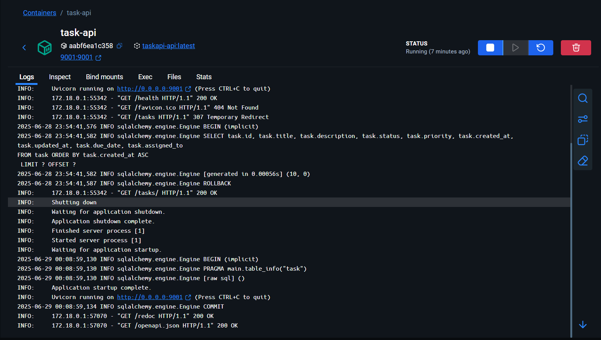
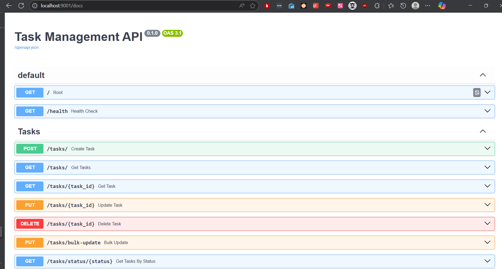

# ✅ Task Management API – FastAPI Intern Assessment

A full-featured **Task Management API** built using **FastAPI**, **SQLModel**, and **SQLite** with support for advanced filtering, sorting, search, bulk operations, database migrations, unit tests, and Docker deployment.

---

## 🚀 Features

- ✅ CRUD operations for managing tasks  
- ✅ Input validation with **Pydantic**  
- ✅ SQLModel integration with SQLite  
- ✅ Pagination, filtering, and sorting  
- ✅ Full-text search in title/description  
- ✅ Bulk update/delete operations  
- ✅ Database versioning with **Alembic**  
- ✅ Containerized with Docker + Docker Compose  

---

## 🧠 Tech Stack

- **FastAPI** – High-performance web framework  
- **Pydantic** – Data validation and serialization  
- **SQLModel** – ORM (based on SQLAlchemy + Pydantic)  
- **SQLite** – Simple file-based database  
- **Alembic** – Database migrations  
- **Docker** – Containerized deployment  

---

## 🧩 Database Schema

| Field       | Type     | Description                     |
|------------|----------|---------------------------------|
| id          | Integer  | Primary key                     |
| title       | String   | Required, max 200 characters    |
| description | String   | Optional, max 1000 characters   |
| status      | Enum     | One of: pending, in_progress, completed, cancelled |
| priority    | Enum     | One of: low, medium, high, urgent |
| created_at  | DateTime | Auto-generated on create        |
| updated_at  | DateTime | Auto-updated on update          |
| due_date    | DateTime | Optional future deadline        |
| assigned_to | String   | Optional assignee (max 100)     |

---

## 📦 Setup Instructions

We can run the application using either way:
- In a local environment
- Using Docker as a container

### 🔧 Install Dependencies

```bash
pip install -r requirements.txt
```

### Run the application

```bash
uvicorn main:app --reload --port 9001
```

### Access API Documentation

- Swagger UI: http://localhost:8000/docs

- ReDoc: http://localhost:9001/redoc


### 🐳 Docker Setup

#### 🏗️ Run using docker-compose

We can start the application by running:

```bash
docker-compose up --build
```

You can pull from [`docker hub`](https://hub.docker.com/r/omarmeska/task-api) directly

```bash
docker pull omarmeska/task-api
```
A POC of container logs:



A Poc of the API docs:



